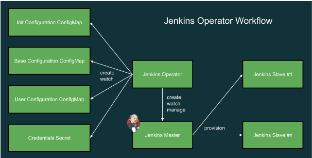
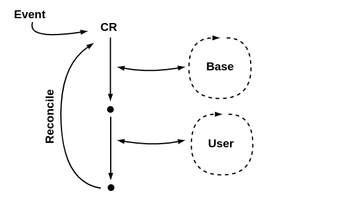

<h1 align="center">Jenkins operator</h1>

### Overview
The Jenkins Operator is a Kubernetes Native Operator which manages operations for Jenkins on Kubernetes. It has been built with immutability and declarative configuration as code in mind. The Jenkins Operator is easy to install with just a few manifest and allows users to configure and manage Jenkins on Kubernetes.

Out of the box it provides:

- Integration with Kubernetes
- Pipelines as Code
- Extensibility via Groovy Scripts
- Secure Defaults and Hardening

There were lot of problems with the standard Jenkins deployment. Jenkins Operator helps to make Jenkins more robust, suitable for dynamic and multi-tenant environments.

Below are problems which will get solved with Jenkins Operator

- Installing plugins with incompatible versions or security vulnerabilities
- Better configuration as code
- Security and hardening out of the box
- Make errors more visible for end users
- Backup and restore for jobs history
- Orphaned jobs with no JNLP connection
- Handle graceful shutdown properly
- Proper end to end tests for Jenkins lifecycle

### Architecture

The Jenkins Operator design incorporates the following concepts:

- Watches any changes of manifests and maintain the desired state according to deployed custom resource manifest
- Implements the main reconciliation loop which consists of two smaller reconciliation loops - **base** and **user**

**Base** reconciliation phase is responsible for ensuring base Jenkins configuration, like Jenkins Master pod, plugins, hardening, etc.
**User** reconciliation phase is responsible for ensuring user-provided configuration, like custom Groovy scripts of Configuration as Code plugin files.

For more details please take a look at [Architecture and Design](https://jenkinsci.github.io/kubernetes-operator/docs/how-it-works/architecture-and-design/) section.

### Objective of tutorial

In this tutorial,we are going to cover following topics:

1. Install Jenkins Operator and verify its successful installation.
2. Create Jenkins Instance and verify status of pods and services.
3. Manually Update Plugins.
4. Access Jenkins Dashboard and create Jenkins Pipeline.
5. Cleanup Operator.
